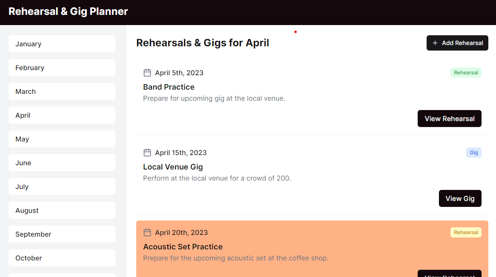

# Sombl

## Overview

Sombl is a site to plan rehearsals for your group. Be it a 3 person band or a 100 person ensemble, plan it on Sombl.

### Problem

When you take the leap to start a band, choir, musical theatre show, a cappella group, or barbershop quartet, the last thing you want to be worrying about is the logistics of managing a rehearsal plan. Managing your group's rehearsals on Sombl makes this group organisation much smoother, so you can focus on what you do best.

### User Profile

- Performance group manager:
  - looking to create a rehearsal plan for their group
  - looking to share the rehearsal plan with the group members

### Features

- As a user, I want to be able to create and account and a group

- As a logged in user, I want to be able to create a rehearsal
- As a logged in user, I want to be able to edit a rehearsal
- As a logged in user, I want to be able to delete a rehearsal
- As a logged in user, I want to be able to create a gig
- As a logged in user, I want to be able to edit a gig
- As a logged in user, I want to be able to delete a gig

- As a user, I want to be able to view a rehearsal plan that has been shared with me
- As a user, I want to be able to view a rehearsal that has been shared with me
- As a user, I want to be able to view a gig that has been shared with me

## Implementation

### Tech Stack

- React
- TypeScript
- MySQL
- Express
- Client libraries:
  - react
  - react-router
  - axios
- Server libraries:
  - knex
  - express
  - bcrypt for password hashing

### APIs

- No external APIs will be used for the first sprint

### Sitemap

- Register/Create Group
- Login
- Home Page
- Rehearsal Details Page
- Gig Details page

### Mockups

#### Color Scheme

[Color scheme on Canva](https://www.canva.com/design/DAGCMzqlDi4/WJCvMetx5xRqJ-o_ARpZdw/edit)

#### Home Page



### Endpoints

**GET /events/:group_id/:month**

- Get list of events for a given group in a given month

Parameters:

- group_id: User account's group_id (default 1 to begin with)
- month: Selected month in state used (eg. 3)

Response:

```
[
    {
        "gig": false;
        "id": 1,
        "group_id": 4,
        "title": "Band Practice",
        "start_time": "2024-03-30 19:00:00",
        "end_time": "2024-03-30 21:00:00",
        "month": 3;
        "street_name": "Vauxhall Gardens Community Hall",
        "postcode": "SW8 1EE",
        "organiser": "Cameron Browne",
        "created_at": "2024-01-30 10:00:00",
        "notes" : "Text..."
    },
    ...
]
```

**GET /events/:id**

- Get individual event details (rehearsal/gig)

Parameters:

- id: event_id provided by the frontend

Response:

```
    {
        "gig": false;
        "id": 1,
        "group_id": 4,
        "title": "Band Practice",
        "start_time": "2024-03-30 19:00:00",
        "end_time": "2024-03-30 21:00:00",
        "month": 3;
        "street_name": "Vauxhall Gardens Community Hall",
        "postcode": "SW8 1EE",
        "organiser": "Cameron Browne",
        "created_at": "2024-01-30 10:00:00",
        "notes" : "Text..."
    }
```

**POST /events**

- User can add a rehearsal/gig

**PUT /events/:id**

- User edit a rehearsal/gig

**POST /groups**

- Add group

Parameters

- name: Group name

Response

```
{
  group_id: "1"
}
```

**POST /users/register**

- Add a user account

Parameters:

- email: User's email
- name: User's name
- password: User's provided password
- role: manager (default at first)
- group_id: 1 (comes from group_id stored after creating group above)
- created_at: creation timestamp

Response:

```
{
    "token": "seyJhbGciOiJIUzI1NiIsInR5cCI6IkpXVCJ9.eyJzdWIiOiIxMjM0NTY3ODkwIiwibmFtZSI6I..."
}
```

**POST /users/login**

- Login a user

Parameters:

- email: User's email
- password: User's provided password

Response:

```
{
    "token": "seyJhbGciOiJIUzI1NiIsInR5cCI6IkpXVCJ9.eyJzdWIiOiIxMjM0NTY3ODkwIiwibmFtZSI6I..."
}
```

### Auth

- JWT auth
  - Before adding auth, all API requests will be using a fake user with id 1
  - Added after core features have first been implemented
  - Store JWT in localStorage, remove when a user logs out

## Roadmap

- Create client

  - react project with routes and boilerplate pages

- Create server

  - express project with routing, with placeholder 200 responses

- Create migrations

- Create seeds with sample rehearsal data

- Feature: Front-End - Create home page

- Feature: List rehearsals and gigs for a given group

  - Display list of rehearsals and gigs for a given group in a given month
  - Create GET /events/:group_id/:month endpoint

- Feature: View rehearsal

  - Implement view rehearsal page
  - Create GET /events/id endpoint

- Feature: View gig

  - Implement view gig page

- Feature: Create rehearsal

  - Implement create rehearsal page
  - Create POST /events endpoint

- Feature: Create gig

  - Implement create gig page

- Feature: Edit rehearsal page

  - Implement edit rehearsal page
  - Create PUT /events/id endpoint

- Feature: Edit gig page

  - Implement edit gig page

- Feature: Create group then account

  - Create login/register page on home route
  - Create POST /groups endpoint (add logic so 2 groups cannot have the same name)
  - Create POST /users/register endpoint
  - Implement create group page + form
  - Implement create account page + form

- Feature: Login

  - Create POST /users/login endpoint
  - Implement login page + form
  - Add logout button on home page

- Feature: Implement JWT tokens

  - Server: Update expected requests / responses on protected endpoints
  - Client: Store JWT in local storage, include JWT on axios calls

- Feature: Create a share url

  - Create button to share rehearsal plan via url
  - Create a route for "/shared" with a 'view only' mode

- Bug fixes

- DEMO DAY

## Nice-to-haves

- Deploy client and server projects to production
- Add ToDo List
- Add AI rehearsal plan generator
- Add a calandr view
- Add file upload funtionailty
